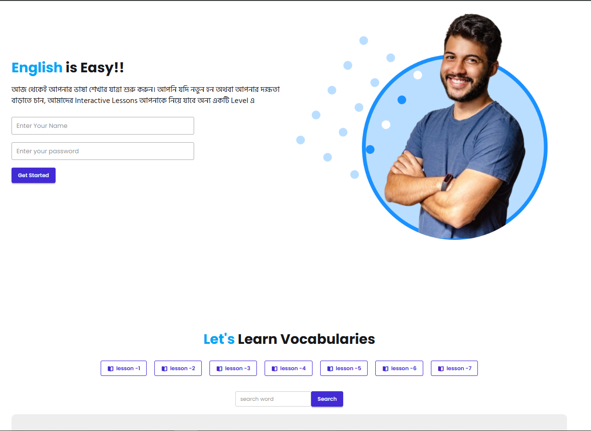
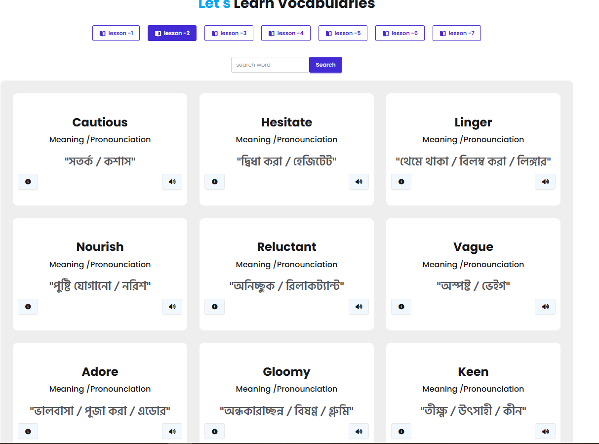
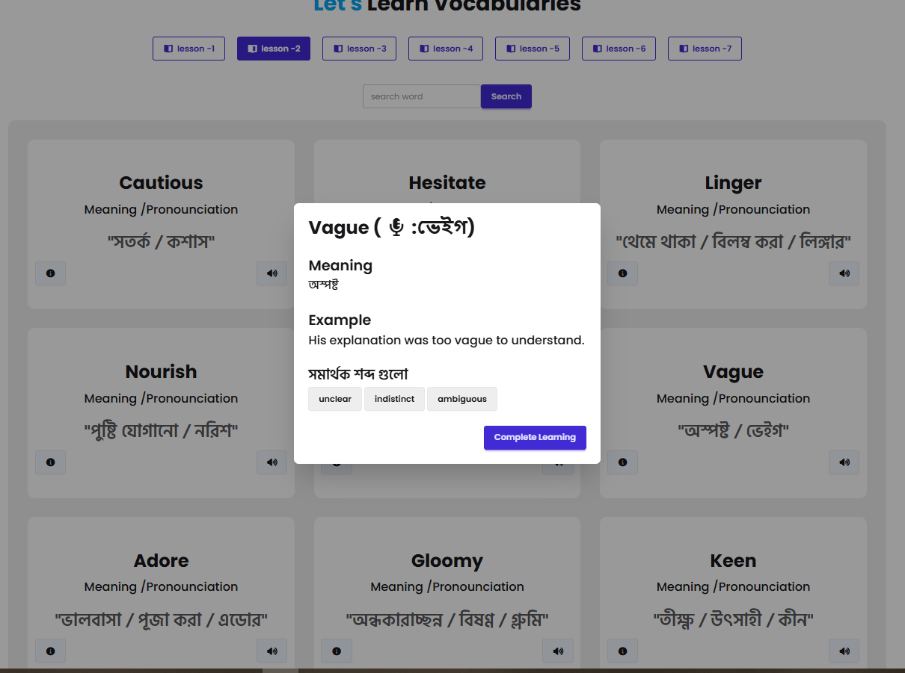

# 🪟 English Janala — Easy English Learning Platform

> আজ থেকেই আপনার ভাষা শেখার যাত্রা শুরু করুন — Start your language learning journey today with interactive vocabulary lessons!

**English Janala** is a beginner-friendly, interactive English vocabulary learning web application. It helps Bengali-speaking users build their English vocabulary step by step through structured lessons, word details, and a clean, responsive UI — all powered by a live REST API.

🌐 **Live Site:** [https://english-janala-project-easy-english.netlify.app/](https://english-janala-project-easy-english.netlify.app/)
📂 **GitHub Repo:** [https://github.com/rashedulislam595/English-Janala](https://github.com/rashedulislam595/English-Janala?tab=readme-ov-file)

---

## 🛠️ Tech Stack

| Technology | Purpose |
|---|---|
| **HTML5** | Markup and page structure |
| **CSS3** | Styling and responsive layout |
| **JavaScript (ES6+)** | Application logic and interactivity |
| **DOM Manipulation** | Dynamic rendering of lessons and words |
| **Fetch API** | Consuming REST API endpoints |

> ⚡ No frameworks. No libraries. Pure Vanilla JavaScript.

---

## ✨ Features

- 📚 **Lesson Selector** — Browse through 7 structured vocabulary levels, from *Basic Vocabulary* to *Mastering Vocabulary*
- 🔍 **Word Search** — Search words within any selected lesson in real time
- 📖 **Word Details** — Click on any word to view its detailed definition, pronunciation, and usage
- ❓ **FAQ Section** — Answers to common questions about using the platform
- 📱 **Responsive Design** — Works seamlessly across desktop and mobile devices

---

## 📡 API Reference

All data is sourced from the [Programming Hero Open API](https://openapi.programming-hero.com/).

### Get All Levels
```
GET https://openapi.programming-hero.com/api/levels/all
```

**Sample Response:**
```json
{
  "status": true,
  "data": [
    { "id": 101, "level_no": 1, "lessonName": "Basic Vocabulary" },
    { "id": 102, "level_no": 2, "lessonName": "Everyday Words" }
  ]
}
```

### Get Words by Level
```
GET https://openapi.programming-hero.com/api/level/{id}
```

**Example:**
```
https://openapi.programming-hero.com/api/level/5
```

### Get Word Details
```
GET https://openapi.programming-hero.com/api/word/{id}
```

**Example:**
```
https://openapi.programming-hero.com/api/word/5
```

### Get All Words
```
GET https://openapi.programming-hero.com/api/words/all
```

---

## 📦 Dependencies

This project has **zero external dependencies**. Everything runs on native browser APIs:

- `fetch()` — for API calls
- `DOM API` — for rendering dynamic content
- `CSS Custom Properties` — for consistent theming

No `npm install` required. ✅

---

## 🚀 Run Locally

Follow these steps to run the project on your local machine:

### 1. Clone the Repository

```bash
git clone https://github.com/rashedulislam595/English-Janala.git
```

### 2. Navigate to the Project Folder

```bash
cd English-Janala
```

### 3. Open in Browser

**Option A — Direct File Open:**
Simply double-click `index.html` to open it in your browser.

**Option B — Using VS Code Live Server (Recommended):**

1. Open the project folder in [VS Code](https://code.visualstudio.com/)
2. Install the [Live Server extension](https://marketplace.visualstudio.com/items?itemName=ritwickdey.LiveServer)
3. Right-click `index.html` → **"Open with Live Server"**
4. The app will launch at `http://127.0.0.1:5500`


---

## 🗂️ Project Structure

```
English-Janala/
├── index.html          # Main HTML file
├── style.css           # Stylesheet
├── script.js           # Main JavaScript logic
└── assets/
    ├── logo.png        # Site logo
    └── hero-student.png # Hero section image
```

---

## 🔗 Relevant Links

| Resource | URL |
|---|---|
| 🌐 Live Demo | [english-janala-project-easy-english.netlify.app](https://english-janala-project-easy-english.netlify.app/) |
| 💻 GitHub Repository | [github.com/rashedulislam595/English-Janala](https://github.com/rashedulislam595/English-Janala) |
| 📡 API — All Levels | [openapi.programming-hero.com/api/levels/all](https://openapi.programming-hero.com/api/levels/all) |
| 📡 API — Words by Level | [openapi.programming-hero.com/api/level/{id}](https://openapi.programming-hero.com/api/level/5) |
| 📡 API — Word Detail | [openapi.programming-hero.com/api/word/{id}](https://openapi.programming-hero.com/api/word/5) |
| 📡 API — All Words | [openapi.programming-hero.com/api/words/all](https://openapi.programming-hero.com/api/words/all) |

---

## 📸 Screenshots




---

## 👤 Author

**Rashedul Islam**
- GitHub: [@rashedulislam595](https://github.com/rashedulislam595)